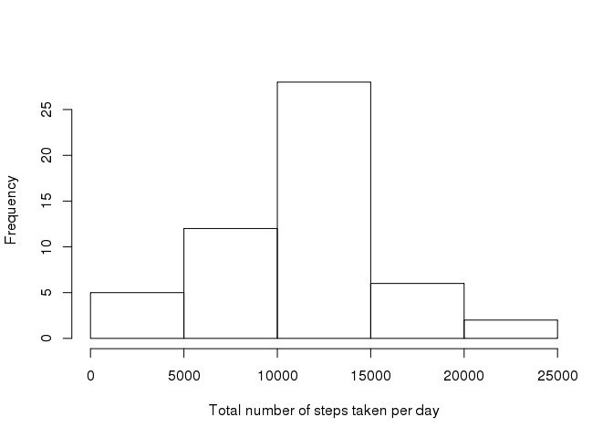
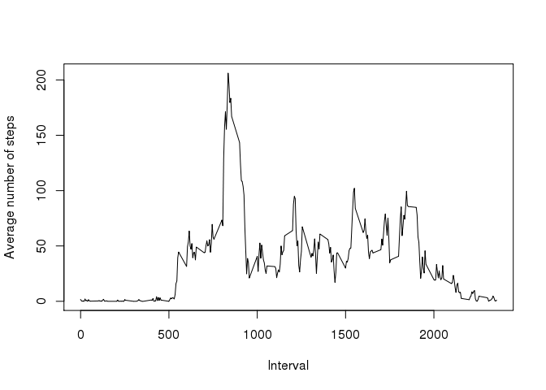
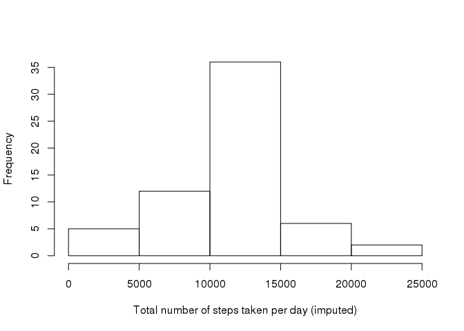
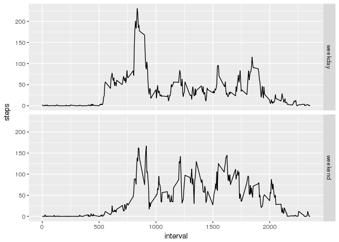

# Reproducible Research: Peer Assessment 1


## Loading and preprocessing the data

```r
setwd("/home/lchen6/xiao/")
dat = read.csv("activity.csv")
dat_clean = dat[complete.cases(dat),]
```

## What is mean total number of steps taken per day?

```r
#Histogram
stepsPerDay = aggregate(dat_clean$steps, list(dat_clean$date), sum)
hist(stepsPerDay$x, xlab="Total number of steps taken per day", main="")
```

<!-- -->

```r
#Mean number of steps taken each day
mean(stepsPerDay$x)
```

```
## [1] 10766.19
```

```r
#Median number of steps taken each day
median(stepsPerDay$x)
```

```
## [1] 10765
```

## What is the average daily activity pattern?

```r
pattern = aggregate(dat_clean$steps, list(dat_clean$interval), mean)
names(pattern) = c("interval", "mean")
plot(pattern$interval, pattern$mean, type = 'l', xlab = "Interval", ylab = "Average number of steps")
```

<!-- -->

```r
#The 5-minute interval that, on average, contains the maximum number of steps
pattern$interval[which.max(pattern$mean)]
```

```
## [1] 835
```

## Imputing missing values

```r
#The total number of rows with NAs
nrow(dat[!complete.cases(dat),])
```

```
## [1] 2304
```

```r
#Impute with the mean for the same 5-minute interval
dat_missing = dat[!complete.cases(dat),]
dat_merged = merge(dat_missing, pattern, "interval", all.x = T)
dat_merged$steps = dat_merged$mean
dat_clean$steps = as.double(dat_clean$steps)
dat_imputed = rbind(dat_clean, dat_merged[, c(2, 3, 1)])

#Histogram
stepsPerDay_imputed = aggregate(dat_imputed$steps, list(dat_imputed$date), sum)
hist(stepsPerDay_imputed$x, xlab="Total number of steps taken per day (imputed)", main="")
```

<!-- -->

```r
#Mean number of steps taken each day
mean(stepsPerDay_imputed$x)
```

```
## [1] 10766.19
```

```r
#Median number of steps taken each day
median(stepsPerDay_imputed$x)
```

```
## [1] 10766.19
```


## Are there differences in activity patterns between weekdays and weekends?

```r
dat_imputed$date = as.Date(dat_imputed$date)
dat_imputed$weekend = ifelse(weekdays(dat_imputed$date) %in% c("Saturday", "Sunday"), "weekend", "weekday")
dat_imputed$weekend = as.factor(dat_imputed$weekend)


pattern_imputed = aggregate(steps ~ interval + weekend, data = dat_imputed, mean)
library(ggplot2)
ggplot(pattern_imputed, aes(interval, steps)) +
  geom_line() +
  facet_grid(weekend ~ .)
```

<!-- -->
